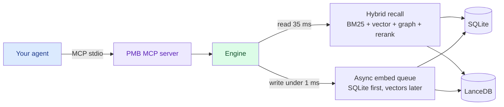

<!-- mcp-name: io.github.oleksiijko/pmb-ai -->

<div align="center">


# PMB

### Local-first memory for your AI coding agent.
### SQLite is the source of truth. No cloud, no API keys, no re-explaining.

[](https://pmbai.dev)
[](https://pypi.org/project/pmb-ai/)
[](https://github.com/oleksiijko/pmb/actions/workflows/ci.yml)
[](https://docs.pmbai.dev)
[](https://pypi.org/project/pmb-ai/)
[](LICENSE)
[](https://modelcontextprotocol.io)
[](https://github.com/mcp/oleksiijko/pmb-ai)


*Local-first memory, visualized. 3,800+ entities and 41,000+ connections, captured automatically as you work.*

[**Website**](https://pmbai.dev) · [**Docs**](https://docs.pmbai.dev) · [Quickstart](#quickstart) · [Demo](#demo) · [Why PMB](#why-pmb) · [How it works](#how-it-works) · [FAQ](#faq)

**Your AI agent forgets everything between sessions.** So you re-explain the same
decisions, lessons and constraints over and over. PMB remembers them in one
local workspace and feeds them back through MCP - no cloud, no API keys, no LLM
call on the read path. And it tells you **when memory is actually helping**,
instead of claiming "+X%".

⭐ **Star the repo if PMB saves you a re-explanation.**

</div>

---

PMB gives Claude Code, Cursor, Codex and the other MCP-aware agents a real
memory: decisions you made last week, lessons you taught them, personal facts,
project structure, PDFs. They survive every restart, every model upgrade, every
agent switch - because they live in a **local workspace you own**, with SQLite
as the durable source of truth and rebuildable search indexes beside it.

No API keys. No subscription. No LLM call on the read path. Just local files.

## Quickstart

```bash
pip install pmb-ai                 # 1. install
pmb setup                          # 2. detect your agent + wire the MCP entry
pmb warmup                         # 3. preload the model (first recall is instant)
# 4. restart your agent, then just talk to it - memory is automatic
pmb stats                          # 5. see what's stored
pmb recall "auth decision"         # 6. search memory from the terminal
pmb doctor                         # 7. confirm everything is wired
```

That's it - your agent now remembers. No account, no keys, nothing leaves your machine.

> **Command name:** the CLI is **`pmb`**. Via `pip` you also get the alias
> **`pmb-ai`**; via `npm` (`npx pmb-ai setup`) the command is `pmb-ai` and it
> installs the Python package first, then runs setup. Same tool - use whichever
> your install gave you.

> **Links:** [pmbai.dev](https://pmbai.dev) (site) ·
> [docs.pmbai.dev](https://docs.pmbai.dev) (docs) ·
> [Getting started](docs/guide/getting-started.md) ·
> [Deleting memories](docs/guide/deleting-memories.md).

---

## Demo

*What it feels like - same prompt, with and without memory:*

<div align="center">

<a href="https://github.com/oleksiijko/pmb/raw/main/docs/assets/pmb-setup.mp4"></a>

<sub>▶ Click to play the 2-minute setup</sub>


</div>

```
You:    fix that LoadGuard pricing bug we hit last Tuesday

Agent:  prepare(message="fix LoadGuard pricing bug")
        ↓ (6 ms)
        → project_context: 12 events about LoadGuard,
          4 lessons (incl. "never lower NEGOTIATE/SKIP under 25%"),
          3 decisions, 2 open goals
        → active_arcs: "LoadGuard verdict-policy refactor (started Tue)"
        → lessons: 1 directly matches "pricing"
        → recent_activity: 8 commits this week

        Looking at src/engine/verdict-policy.ts (you opened it Tuesday
        14:32, last changed Wednesday). The pricing bug is on line 142
        where the bundle fallback tightened below the rate-floor. Per the
        lesson you saved, we never drop the threshold under 25% - restoring
        the guard there.
```

The agent didn't ask. It didn't guess. It read its memory in **6 ms** and
showed up already informed.

---

## Why PMB

- **Local-first, zero-config.** SQLite holds the durable memory; rebuildable search indexes stay local. No account, API keys, telemetry, or cloud to trust.
- **It actually gets used.** On Claude Code / Codex, hooks inject the right memory *before* the model thinks - you never have to remember to call a tool.
- **Multilingual, no setup.** The embedder covers 50+ languages; a Russian query finds an English fact. No per-language config.
- **MCP-native.** One `pmb connect` wires Claude Code, Cursor, Codex, Windsurf, Zed, VS Code, and more.
- **Fast read path.** Recall in ~35 ms warm; writes return in under a millisecond - no LLM call to remember.
- **Honest impact.** The dashboard shows which lessons actually changed outcomes, instead of claiming "+X%".
- **Your data, in the open.** `pmb export` dumps everything to Markdown/JSON. Apache 2.0.

---

## See your memory

`pmb dashboard` opens a local, liquid-glass web UI on `http://127.0.0.1:8765`
over everything PMB captured - written automatically, just by working. It binds
to `127.0.0.1` only, so nothing leaves your machine.

<div align="center">


*Map - every entity and connection in your project, as a live graph.*


*Timeline - your memory as a journal, newest first.*

</div>

Nine tabs: **Map** (entity graph, live), **Timeline** (git-graph by project),
**Overview**, **Entities**, **Arcs** (narrative threads), **Lessons** (per-rule
follow-rate, dead-lesson detection), **Duplicates** (inline merge),
**Performance** (per-tool latency), **Recall** (debug ranker).

---

## What you can store

```bash
# Personal facts that change (time-travel: old values archived, never lost)
record_keyed_fact("user", "city", "Warsaw")

# Project structure - symbols, imports, .gitignore-aware
pmb index project .

# Why each file exists + the intent behind every commit (Haiku-summarised, local)
pmb track modules                # one-line purpose per indexed file
pmb track changes                # new commits: what changed and WHY

# PDFs (research papers, manuals, contracts)
pmb index pdf paper.pdf
pmb index pdf ~/docs --recurse

# Whatever your agent logs as it works: decisions, lessons, completed tasks, goals
```

PMB is content-agnostic. If it's text the agent will care about later, PMB
remembers and retrieves it.

## What the agent gets back

A single MCP call - `prepare(message)` - returns the right things at the right
level of detail, in 4-16 ms:

| Field | What it is |
|---|---|
| `project_context` | Full project overview if the message mentions a project: key facts, lessons (RULES to follow), decisions, open goals, related entities, the project's narrative arc |
| `lessons` | Procedural rules matching the query, each with a `surface_id` so the agent can confirm it followed the rule later |
| `recent_activity` | Last 24 h of decisions / edits / completions for session continuity |
| `open_goals` | In-progress goals so the agent knows what you're pursuing |
| `active_arcs` | Narrative arcs the project is currently living in |

For everything else there's `recall(query)` (hybrid search, 35 ms warm) and 27
other tools in [docs/reference/COMMANDS.md](docs/reference/COMMANDS.md).

---

## How it works



- **Storage** - every durable event lives in SQLite, the source of truth. Rebuildable vector indexes live in LanceDB beside it. The whole workspace stays on your disk and can be copied or exported anytime.
- **Recall** - BM25 (lexical) + dense vector (semantic) + entity graph + optional cross-encoder rerank, fused via Reciprocal-Rank-Fusion.
- **Writes** - async. The MCP tool returns in under a millisecond; the embed + LanceDB insert happen on a background thread.
- **Dedup** - four layers: exact text match -> cosine >= 0.92 auto-merge -> cosine 0.80-0.92 borderline (LLM verify later) -> manual review in the dashboard. Old values are archived, never deleted; full history via `keyed_fact_as_of(t)`.
- **Multilingual - no language packs.** The default embedder (`paraphrase-multilingual-MiniLM-L12-v2`) covers 50+ languages, so *где я живу* finds a keyed-fact stored as *user.city = Warsaw*. Intent detection rides English semantic anchors that transfer cross-lingually, and the cold lexical path self-compiles from your own traffic. Recall stays strong across ~11 languages (top-3 ~= 0.9 on a 101-query eval; top-1 = 1.00 for en/fr/pt/ru). See [docs/contributing/adding-a-language.md](docs/contributing/adding-a-language.md).

---

## Install

The [Quickstart](#quickstart) above is all most people need. Other ways:

```bash
# From source
git clone https://github.com/oleksiijko/pmb.git && cd pmb
python -m venv .venv && source .venv/bin/activate
pip install -e .
pmb warmup                       # prime the ~450 MB embedder once
```

Wire one or more agents (all stdio - the server runs as a child of your agent;
no network, no port, no token):

```bash
pmb connect claude-code   # also: codex · cursor · windsurf · gemini · vscode · zed · opencode · continue
```

Point several agents at one memory:

```bash
pmb connect claude-code --workspace personal
pmb connect cursor      --workspace personal   # both read/write the same workspace
```

> Sharing one memory across machines or a team? That's an optional HTTP mode
> with bearer-token auth - see [docs/guide/TEAM.md](docs/guide/TEAM.md). Not needed for local use.

> **Running the tests?** Use the venv's Python: `.venv/bin/python -m pytest`
> (or `.venv\Scripts\python.exe -m pytest` on Windows). Bare `pytest` outside
> the venv just reports missing `numpy`/`fastmcp`/`typer`.

---

## CLI cheat sheet

```bash
# Memory
pmb stats                                   show counts and storage info
pmb recall "query"                          search with full debug
pmb dashboard                               web UI on port 8765 (graph, settings, errors)

# Ingest
pmb index pdf paper.pdf                     extract + chunk + embed
pmb index pdf ~/docs --recurse              entire directory
pmb index project .                         scan codebase
pmb track changes                           summarise commit intent (why)
pmb track modules                           one-line purpose per module
pmb import chatgpt ~/Downloads/export.json  bring existing history

# Continuity & efficiency (opt-in)
pmb resume save                             write .pmb/resume.md (commit it)
pmb resume install                          refresh resume.md at every turn end
pmb health lessons-impact                   which lessons actually help outcomes
pmb memory ledger                           Memory Delta handles this session

# Maintenance
pmb regraph                                 rebuild entity graph
pmb consolidate                             run sleep pass (optional)
pmb compact                                 archive old events
pmb dedupe                                  resolve borderline duplicates

# Hooks (force-feed PMB at the protocol level - no model cooperation)
pmb hooks install claude-code               wire all lifecycle hooks
pmb hooks list                              show what's installed
pmb hooks capabilities                      ambient mechanism each agent supports
pmb hooks uninstall claude-code             remove them
pmb auto-context "fix bug in PMB"           preview per-turn injection
pmb session-restore -m 180                  preview post-compaction restore
pmb lesson-followcheck --dry-run            preview follow-through scoring

# Ambient memory (the write side - memory journals the agent's work)
pmb autowrite --dry-run                     preview ambient auto-write for this turn
pmb ambient-watch .                         ambient auto-write for MCP-only hosts (git observer)
pmb forget-auto                             drop memory the ambient layer wrote itself

# Config
pmb config list                             default tier (25 keys you care about)
pmb config list --pro                       every key, including 80 advanced knobs
pmb config set recall.ppr_enabled true      toggle a feature
pmb connect --rules-only                    refresh CLAUDE.md only
```

Step-by-step per agent: [docs/guide/usage.md](docs/guide/usage.md). Full
reference: [docs/reference/COMMANDS.md](docs/reference/COMMANDS.md).

---

## Hooks - memory that doesn't wait to be asked

The hard part of agent memory isn't storing - it's getting the agent to *use*
what's stored. Soft instructions in a rules file get skipped. So PMB wires hooks
at the protocol level (`pmb hooks install claude-code`), each removing a
dependency on the model remembering to act:

- **UserPromptSubmit -> auto-recall.** Every message is classified (regex, multilingual, sub-ms) and the matching memory - lessons, past decisions, recall hits, project overview - is injected *before* the model thinks. Trivial messages inject nothing.
- **PostToolUse -> ambient observe.** Every tool the agent runs is appended to a lightweight action journal (a single SQLite INSERT, no model). Reads and `ls` are filtered out; edits, tests and commits are kept.
- **SessionStart -> session-restore.** After a context compaction the agent rebuilds "where you left off" from what the session recorded, instead of re-asking you.
- **Stop -> follow-through + ambient auto-write.** (a) It checks which surfaced lessons actually showed up in what the agent did and marks them followed, *deterministically*. (b) If the agent did NOT call a `record_*` tool, it synthesizes one activity entry from the observed actions - so real work is captured even when the agent stays silent.

Preview any without an agent: `pmb auto-context "..."`, `pmb session-restore -m
180`, `pmb lesson-followcheck --dry-run`, `pmb autowrite --dry-run`.

## Ambient memory - the write side

Auto-recall fixed the *read* side; ambient memory does the same for the *write*
side - the memory journals the agent's work even when it forgets `record_batch`:

- **Coordinated.** If the agent already called a `record_*` tool this turn, ambient stays silent; it only fills the gap.
- **Outcome-scored, not churn.** A turn is journaled only if results clear a quality bar (tests passed, a failure fixed, a deploy ran), not by file count alone.
- **Honest + reversible.** Every ambient entry is tagged `source=autowrite`, shown as auto in the dashboard, and removable with `pmb forget-auto`. **On by default**; disable with `pmb config set autowrite.enabled false`.
- **Works on every host.** Claude Code (hooks), Codex (`pmb codex-notify`), MCP-only hosts like Cursor/Zed/VS Code (git observer, `pmb ambient-watch .`). Check yours with `pmb hooks capabilities`.

Synthesis is template-based by default (instant, no model). Opt into a local/API/CLI
model summary with `pmb config set autowrite.synthesizer llm:ollama` or `llm:openai`
(it has a timeout and falls back to the template).

## Self-improvement loop

Every surfaced lesson carries a `surface_id`. Follow-through is recorded both
ways: the agent confirms via `mark_lesson_followed(surface_id, True)`, and the
**Stop hook** infers it from recorded activity. The **Lessons tab** then shows,
per rule: how often it was shown, how often it was followed, `★ USEFUL`
(followed >= 2x), `? UNVERIFIED` (surfaced but unconfirmed), and `💀 DEAD` only
when a rule is repeatedly **ignored** (>= 2). You see which rules help and prune
the ones that don't.

---

## Settings - 25 you care about, 80 you don't

PMB has 105 tunables. The 25 that affect day-to-day quality are **default-tier**
(`pmb config list`). The rest are internal weights and experimental flags,
hidden behind `--pro` so the surface stays scannable. Every pro key still reads
with `pmb config get` and writes with `pmb config set` - hidden from `list`, not
gated.

| Key | Default | What it does |
|---|---|---|
| `recall.top_k` | 5 | How many results recall returns |
| `recall.bm25_weight` | 0.7 | BM25 vs vector mix (1.0 = pure BM25) |
| `recall.ppr_enabled` | **true** | Multi-hop graph diffusion, gated by intent |
| `recall.keyed_fact_boost` | 0.35 | How hard personal-attr facts win on personal queries |
| `recall.rerank` | false | Always-on cross-encoder (regresses LoCoMo, keep off) |
| `embedding.model` | `paraphrase-multilingual-MiniLM-L12-v2` | The vector model |
| `graph.extractor` | `regex` | `regex` / `spacy` / `llm:claude` / `llm:openai` / `llm:ollama` / `llm:codex` |
| `mcp.record_batch_async` | true | Fire-and-forget writes (sub-ms return) |
| `agent.apply_lessons` | true | Agent surfaces lessons before acting |
| `dedup.enable` | true | All four dedup layers |
| `decay.factor_per_day` | 0.985 | Importance half-life |
| `chat.model` | `haiku` | Default model for `pmb-chat` |

---

## Numbers

| | |
|---|---|
| Recall p50 / p95 warm | **35 ms / 110 ms** |
| `prepare(message)` warm | **4-16 ms** |
| `record_batch_async` | **&lt; 1 ms** |
| MCP cold boot | **3.7 s** |
| LoCoMo recall@10 (n=10) | **94.5 %** |
| Multilingual mega-stress top-10 (900 q) | **99.2 %** |

```bash
# Reproduce locally
python scripts/benchmarks/benchmark_locomo.py --n-conversations 10
python scripts/benchmarks/mega_stress_test.py
```

---

## <a name="privacy"></a>Privacy

- 100 % offline by default. No network calls from the engine, zero telemetry - there is no PMB server to call home to.
- Workspace = a directory under `~/.pmb/<name>/`. Copy it to Dropbox, push it to git, share it on a USB drive. Your call.
- Secrets are auto-redacted at write time (OpenAI / Anthropic / AWS / Stripe / GitHub keys; configurable).
- Apache 2.0 licensed. Forks welcome.

---

## FAQ

**Does PMB call an LLM?** On read: never. On write: never by default. Optional:
`pmb consolidate` can run a local Ollama, Claude CLI, Anthropic, or OpenAI pass to write short
reflections - opt-in.

**What about cost?** $0. There is no PMB service.

**Does the agent need to know about PMB?** After `pmb connect`, the rules are
appended to `CLAUDE.md` / `AGENTS.md` automatically. The default profile exposes
10 core MCP tools (including the `prepare()` read-first pattern); wider profiles
exist for ingestion and admin.

**Will it slow my agent down?** Tools return in single-digit milliseconds for
everything except `recall` (35-110 ms warm), which is below human perception.

**Can two agents share one memory?** Yes - point them at the same workspace.
SQLite WAL + a 10 s busy-timeout handle concurrent writes.

**Wipe a fact?** `pmb forget <ulid>` archives it (excluded from recall, restorable).
Hard-delete: `pmb delete <ulid> --hard`.

**Windows?** Yes - tested on Windows 11, macOS 14, Ubuntu 22.04. Cyrillic paths
and console encoding are handled.

**PDFs / code / Markdown?** `pmb index pdf paper.pdf`, `pmb index project .`,
`pmb import markdown ~/notes/`, `pmb import chatgpt path.json`.

**Cold start is slow.** First recall loads the embedding model (~3 s). Run
`pmb warmup` once, or let the prewarm thread handle it in the background.

**Roadmap?** See [docs/ROADMAP.md](docs/ROADMAP.md): litestream backup, optional
cloud-sync (BYO bucket), tree-sitter project indexing, image OCR.

---

## Contributing

Issues and PRs welcome. There's one full-time maintainer; please open a
discussion before a large change so we can align on direction.

```bash
git clone https://github.com/oleksiijko/pmb.git && cd pmb
python -m venv .venv && source .venv/bin/activate
pip install -e ".[dev]"
pytest                  # full suite, ~4 minutes
pytest -k recall        # fast subset, ~12 s
```

### Dev commands

```bash
bash scripts/test.sh                 # whole suite (CI-equivalent)
bash scripts/test.sh tests/recall    # a subset (any pytest args pass through)
bash scripts/codeql_local.sh         # run CI's CodeQL security-extended locally
bash scripts/install-dev-hooks.sh    # pre-commit hook: ruff + CodeQL before each commit
```

`scripts/codeql_local.sh` auto-installs the CodeQL bundle on first run and runs
the exact suite CI uses, so security findings are caught locally instead of on a
push. The pre-commit hook bypasses with `git commit --no-verify` (or skip just
the scan with `SKIP_CODEQL=1`).

License: **Apache 2.0**.
